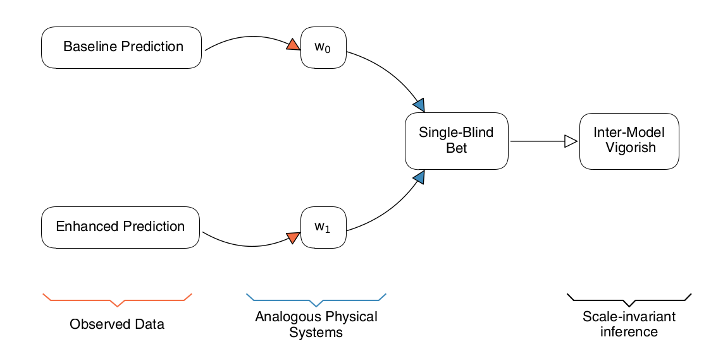

## :bar_chart: Introducing the InterModel Vigorish  :chart_with_upwards_trend:


[](https://shields.io/)
[](https://shields.io/)
[](https://shields.io/)
[](https://shields.io/)
[](https://doi.org/10.5281/zenodo.5054717)

---
A repo to introduce the InterModel Vigorish metric. A quick and important note; __full and unreserved accreditation for all of the [R](https://www.r-project.org/) code in this library should go to the magnificent [Ben Domingue](https://github.com/ben-domingue)!__ His repo for this project can be found [here](https://github.com/ben-domingue/binary-prediction). A link to the accompanying working paper entitled 'InterModel Vigorish (IMV): A novel approach for quantifying predictive accuracy when outcomes are binary' can be found [here](https://osf.io/preprints/socarxiv/gu3ap/). Abstract copied in here:

```
Understanding the 'fit' of models meant to predict binary outcomes has been a long-standing problem. We propose a novel metric---the InterModel Vigorish (IMV)---for quantifying the value of change in predictive accuracy between two systems in the case of a binary outcome. The metric is based on an analogy to well-characterized physical systems with tractable probabilities. We first translate a baseline prediction of some binary outcomes into a statement about a canonical system---weighted coins---by equating the entropy of the two systems. We then use the weighted coin for a baseline prediction to establish a fair bet. For a second predictive system that we want to gauge relative to the baseline, we use the notion of expected winnings from a single-blind bet wherein the second weighted coin has replaced the first (the opposing player being blinded to this replacement). The resulting quantity has a scale that is both generally applicable and not dependent on the magnitude of the baseline prediction; moreover, it is always a statement about the change in fit relative to some baseline (which can simply be the prevalence) whereas other metrics (e.g., AUC) are stand-alone measures that need to be further manipulated to yield indices related to differences in fit across models. As the IMV inherently focuses on differences between models it is similar to likelihood ratio tests or ANOVA-based model comparisons. We illustrate the properties of this metric in simulations and its value in empirical applications related to health, political affiliation, and item responses. We  also reconsider results from the recent Fragile Families Challenge using the IMV metric.
```

### ./data/*

In addition to the simulations (Figures 2d, 3a-3b, and 4a-4d), there are three main empirical/observational data sources used by this project, as detailed below:

* The FFC replication data can be obtained from the Harvard Dataverse: [https://doi.org/10.7910/DVN/CXSECU](https://doi.org/10.7910/DVN/CXSECU). Given that we also re-estimate individual probabilities for the three binary traits, we also need the raw data from Princeton's Office of Population Research ([OPR](https://pop.princeton.edu/)), i.e., you'll need to drop some FFC (V.5) data into ``./data/FFC/private`.

* For the Health and Retirement Survey (HRS) data, we are predominantly using the `randhrsimp1992_2016v1.dta` file from [RAND](https://www.rand.org/well-being/social-and-behavioral-policy/centers/aging/dataprod.html), though we also use `h10da`, `h10sta`, `h12da`, `h12sta`, `h14da`, `h14sta`, `h04da`, `h04sta`, `h06da`, `h06sta`, `h08da`, `h08sta`.

* The GSS data comes from [NORC](https://gss.norc.org/get-the-data). A full list of the variables used can be found at `./data/GSS/GSSvars`.

Where possible (as with the simulated results in `./data/sims`), we have included aggregated outputs (in accordance with licensing restrictions).

### ./src/*

The code in this repo is in both R (again, with full and unreserved attribution to [Ben](https://github.com/ben-domingue)!) and Python. With a full working R and Python (>3.5) installation, and with data deposited into the appropriate subdirectories as a described above, `main.ipynb` should painlessly replicate all of the figures and results in the paper (drawing from other modules, with the help of [rpy2](https://rpy2.github.io/doc/latest/html/introduction.html)). A quick rundown as follows:

* _./src/main.ipynb_: Replicate all analysis (Figures 1 through A1) in the paper, with outputs in `./results/figures`.
* _./src/big_fun.R_: A place to store [Ben](https://github.com/ben-domingue)'s core IMV functionalities (e.g. `ll`, `getp`, etc).
* _./src/big_fun.py_: Equivalent to the above, but in Python.
* _./src/simp_coins.R_: [Ben](https://github.com/ben-domingue)'s simple coins example from the earlier part of the paper.
* _./src/simp_coins.py_: Replicates [Ben](https://github.com/ben-domingue)'s simple coins part of the paper in Python and checks for equivalence via [rpy2](https://rpy2.github.io/doc/latest/html/introduction.html).
* _./src/make_gss_imv.R_: [Ben](https://github.com/ben-domingue)'s code for cleaning the GSS and model building.
* _./src/make_hrs_prep.R_: [Ben](https://github.com/ben-domingue)'s code for preparing the HRS data for _./src/make_hrs_pred.R_.
* _./src/make_hrs_pred.R_: [Ben](https://github.com/ben-domingue)'s code for predicting probabilities for the HRS data.
* _./src/make_r2_sims.R_ : [Ben](https://github.com/ben-domingue)'s code for making the simulation outputs for Figure 2.D
* _./src/make_simulations.R_: [Ben](https://github.com/ben-domingue)'s code for making the simulation outputs for Figures 3 and 4.
* _./src/make_ffc_d/_: A version of the `aggregate_score_analyses.R` file written by Ian Lundberg, and slightly modified to output `logit` outcomes, obtainable from the [Harvard Dataverse](https://doi.org/10.7910/DVN/CXSECU).
* _./src/figure_1_function.py_: A module which creates the 1igure 1 schematic outlining how the IMV works.
* _./src/figure_2_function.py_: A module which visualizes the descriptive properties of the IMV as shown in Figure 2.
* _./src/figure_3_function.py_: A module which visualizes the outcomes for the simulation exercise with predictions based on _x_ alone.
* _./src/figure_4_function.py_: A module which visualizes the outcomes for the simulation exercise with predictions based on _x_ and _z_.
* _./src/figure_5_function.py_: Visualizing the IMVs for the HRS application.
* _./src/figure_6_function.py_: Visualizing the IMVs for the GSS application.
* _./src/figure_7_function.py_: Calculating the IMV for various (logit) predictions of the benchmark models for the three binary outcomes. Visualizes IMV for benchmark vs. actual submissions.
* _./src/figure_a1_function.py_: Plots the descriptive (Figure A.1) figure for the HRS data.

As always, requirements can be found in the _requirements.txt_ (e.g. be sure to `pip install -r requirements.txt` when cloning) file. Please raise all issues for tracking as appropriate!
