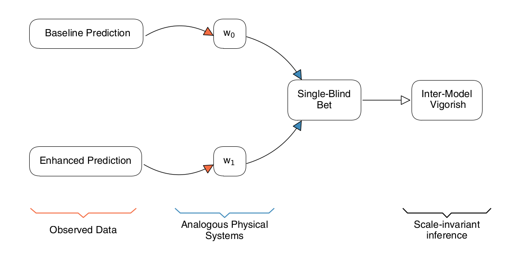

## :bar_chart: Introducing the InterModel Vigorish  :chart_with_upwards_trend:

---
A repo to introduce the InterModel Vigorish metric. A quick and important note; __ unreserved accreditation for most of the [R](https://www.r-project.org/) code should go  [Ben Domingue](https://github.com/ben-domingue)!__ His repo for this project can be found [here](https://github.com/ben-domingue/binary-prediction). All files for which he is an author begin with an '#Author: github.com/ben-domingue' statement. Shiny app developed by [Klint Kanopka](https://github.com/klintkanopka). A link to the accompanying working paper entitled 'InterModel Vigorish (IMV): A novel approach for quantifying predictive accuracy when outcomes are binary' can be found [here](https://osf.io/preprints/socarxiv/gu3ap/). Abstract copied in here:

> **Abstract**: Understanding the 'fit' of models designed to predict binary outcomes has been a long-standing problem across the social sciences. We propose a flexible, portable, and intuitive metric for quantifying the change in accuracy between two predictive systems in the case of a binary outcome: the InterModel Vigorish (IMV). The IMV is based on an analogy to weighted coins, well-characterized physical systems with tractable probabilities. The IMV is always a statement about the change in fit relative to some baseline model---which can be as simple as the prevalence---whereas other metrics are stand-alone measures that need to be further manipulated to yield indices related to differences in fit across models. Moreover, the IMV is consistently interpretable independent of baseline prevalence. We contrast this metric with alternatives in numerous simulations. The IMV is more sensitive to estimation error than many alternatives and also shows distinctive sensitivity to prevalence. We showcase its flexibility across high-profile examples spanning the social sciences. The IMV allows for precise answers to questions about changes in model fit in a variety of settings in a manner that will be useful for furthering research and the understanding of social outcomes.

#### Library Description

A lot is going on in this paper! See:
* `./example_coins/*` for three 'toy' examples which introduce the IMV in the context of simple, weighted coins.
* `./example_titanic/*` for three simple examples of how the  IMV can be calculated in practice, all with use and refernece to the infamous Titanic dataset.
* `./src/*` for all empirical and simulated analysis.
* `./results/` for all the final results: tables and figures.
* `./data/*` holds all of the _post-processed_ data and simulation results.
* `./imv_app/*` holds code to replicate the Shiny Application accompanying the paper. 

#### Data Availability Statement

* The FFC replication data can be obtained from the [Harvard Dataverse](https://doi.org/10.7910/DVN/CXSECU). Given that we also re-estimate individual probabilities for the three binary traits, we also need the raw data from Princeton's Office of Population Research ([OPR](https://pop.princeton.edu/)), i.e., you'll need to drop some FFC (V.5) data into ``./data/FFC/private`.

* For the Health and Retirement Survey (HRS) data, we are predominantly using the `randhrsimp1992_2016v1.dta` file from [RAND](https://www.rand.org/well-being/social-and-behavioral-policy/centers/aging/dataprod.html), though we also use `h10da`, `h10sta`, `h12da`, `h12sta`, `h14da`, `h14sta`, `h04da`, `h04sta`, `h06da`, `h06sta`, `h08da`, `h08sta`.

* The GSS data comes from [NORC](https://gss.norc.org/get-the-data). A full list of the variables used can be found at `./data/GSS/GSSvars`.

Where possible (as with the simulated results in `./data/sims`), we have included aggregated outputs (in accordance with licensing restrictions).

#### Visualisations

Visualisations for all figures in the paper are undertaken by two `.ipynb` notebooks which call helper functions from files in `./src/visualisation`. These notebooks are: `./src/3_plot_main.ipynb` and `./src/4_plot_suppmat.ipynb/`for the main material and the supplementary material respectively.

#### Running the code

Requirements can be found in the _requirements.txt_ (e.g. be sure to `pip install -r requirements.txt` when cloning) file. Please raise all issues for tracking as appropriate!

#### License

This work is made available under a GNU General Public License v3.0.
